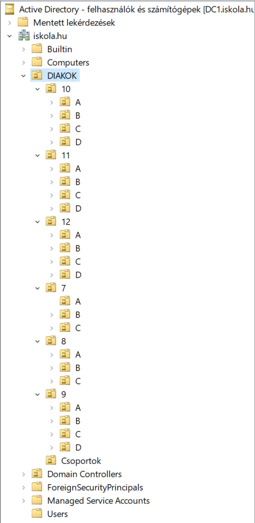
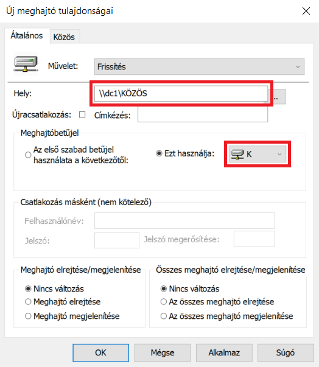

# Active Directory School Manager
### Ez a PowerShell szkript a magyar iskolák Active Directory rendszerének kezelésére szolgál, lehetővé téve a diákok rendszerezését és az évfolyamok léptetését.
Fő jellemzők:
* Diákok hozzáadása, törlése, jelszavak visszaállítása
* Diákok saját mappáinak beállítása
* Osztályok csoportjainak beállítása
* Az *Active Directory: Felhasználók és számítógépek* ablakban a diákok szervezeti egységekben (organizational unit) való rendezése
* **Évfolyamok léptetése**
## Tartalomjegyzék
- [Telepítés](#telepítés)
- [Használat](#használat)
- [Funkciók](#funkciók)
- [Galéria](#galéria)
- [Hibakeresés](#hibakeresés)
- [Támogatás](#támogatás)
- [Active Directory telepítése és beállítása](#active-directory-telepítése-és-beállítása)
## Telepítés
Windows Server 2012 R2 és korábbiakon telepíteni kell a [Windows Management Framework 5.1](https://www.microsoft.com/en-us/download/details.aspx?id=54616)-et, azon belül a *Win8.1AndW2K12R2-KB3191564-x64.msu*-t, mert ebben van 5.1-es Powershell, amiben lehet csomagokat telepíteni. Illetve be kell írni a Powershell ablakba a *[Net.ServicePointManager]::SecurityProtocol=[Net.SecurityProtocolType]::Tls12* parancsot.
1. Letöltöd a repóból a szkriptet és futtatod. A szkript a [Sebazzz/PSMenu](https://github.com/Sebazzz/PSMenu) kódot használja a menü megjelenítéséhez, és azt, valamint a telepítéshez szükséges NuGet csomagkezelőt magától telepíti.
2. A *Konfiguráció beállítása* segítségével beállítod a konfigurációt. Segítség lejjebb.
3. A szkript alapból 7-12 évfolyamokra, és A; B; C osztályokra van beállítva, és egy D osztályra a 9. évfolyamtól. Ezek egyszerűen átállíthatóak, illetve ha a D osztályos funkcióra nincs szükség, akkor egy nagy számra állítsd át az *Global:OtherClassFrom* változóban. Állíthatod még a konfigurációs fájl nevét, és a diákok kezdőmappájának betűjelét.
4. Generáld le a mappákat, csoportokat, és szervezeti egységeket.
5. Add hozzá a diákokat.
## Használat
A funkciók egy menürendszeren keresztül érhetők el. Indítás után válaszd ki a megfelelőt:
1. Diákok hozzáadása
2. Diák jelszavának visszaállítása
3. Diákok felsőbb évfolyamba léptetése
4. Diák törlése
5. Almenü
6. Kilépés

Az almenüben találhatóak (ezeket csak egyszer kell megcsinálni):
1. Konfiguráció beállítása
2. Mappák generálása
3. Csoportok generálása
4. Szervezeti egységek (OU) generálása

Minden menüponthoz tartozó részletes leírást alább találsz.
## Funkciók

- **Konfiguráció beállítása**: beállítod vele a szkriptnek szükséges dolgokat. Úgymint:
  - Domain: a tartomány domainneve. (pl. iskola.hu)
  - Szervernév: a szerver neve, amin fut a szkript. (pl. DC1)
  - Gyökérmappa: a diákok saját mappáinak a gyökérmappája. (pl. C:\DIAKOK) Ezen belül vannak az évfolyamok (pl. 7-12), és azokon belül az osztályok (pl. A; B; C). A mappa engedélyeit és a megosztást neked kell beállítani, a következők szerint:
    - Tulajdonságok &#8594; Biztonság &#8594; Speciális &#8594; Öröklődés letiltása (*Az örökölt engedélyek kifejezett engedélyekké való konvertálása*); *Felhasználók: Olvasás és végrehajtás* eltávolítása
    - Tulajdonságok &#8594; Megosztás &#8594; Speciális megosztás &#8594; Mappa megosztása &#8594; Engedélyek:
      - Mindenki: Olvasás
      - Tartományfelhasználók: Teljes hozzáférés
    - Ezek biztosítják, hogy a diák csak a saját mappáját láthassa, és a másokét nem.
  - Megosztott gyökérmappa (pl. DIAKOK): az előbb tárgyalt gyökérmappa megosztott neve. Ha nem állítottad át, akkor a gyökérmappa nevét írd be.
  - Csoport: a csoport neve, amiben a diákok lesznek (pl. Diak)
  - Gyökér OU az *Active Directory: Felhasználók és számítógépek* ablakban: az a szervezeti egység (OU), ahol a diákok lesznek tárolva, akárcsak a gyökérmappában. (pl. DIAKOK) Ezt neked kell létrehozni, és kapcsold ki a Véletlen törlés elleni védelmet! Ha rögtön a domainneven belül van, akkor csak a nevét írd be. De ha pl. a VALAMI&#8594;MÁSIK&#8594;DIAKOK az "elérési út", akkor a VALAMI\MÁSIK\DIAKOK-at írd be.
  - Alapértelmezett jelszó: az újonnan regisztrált diákok jelszava, amit az első bejelentkezéskor meg kell változtatniuk. (pl. 12345678). Ha ehhez hasonló jelszót akarsz használni, akkor meg kell változtatni a jelszóházirendet, amit [ITT](#4-jelszóházirend-beállítása) tehetsz meg.
- **Mappák generálása**: legenerálja az évfolyam- és osztálymappákat a gyökérmappában.
- **Csoportok generálása**: minden osztálynak csinál saját csoportot, illetve egyet, amiben minden diák benne van.
- **Szervezeti egységek (OU) generálása**: legenerálja a szervezeti egységeket, ahol a diákok lesznek évfolyamonként, azon belül pedig osztályonként.
- **Diákok hozzáadása**: a megadott osztályhoz ad hozzá diákokat. Ha Entert nyomsz (tehát üres nevet írsz be), akkor visszalép a menübe.
- **Diák jelszavának visszaállítása**: a megadott diáknak visszaállítja a jelszavát.
- **Diákok felsőbb évfolyamba léptetése**: eggyel magasabb évfolyamba lépteti a diákokat mindenükkel együtt, a legnagyobbaknak (pl. 12-esek) pedig mindenét törli. Ez talán a leghasznosabb funkció.
- **Diákok törlése csoport alapján**: törli az összes, a megadott csoportban található diákot és mappájukat. A _*_ minden diákot töröl.
- **Diák törlése név alapján**: törli a megadott diákot és mappáját.
## Galéria
Mappák | Csoportok | Szervezeti egységek
:---:|:---:|:---:
 |  | 

Főmenü | Almenü
:--:|:--:
 | 
## Hibakeresés
A szkript csak helytelen konfiguráció és/vagy helytelen bemeneti adatok esetén ad hibát. Ellenőrizd, hogy a konfiguráció és a bemeneti adatok helyesek-e.
## Támogatás
Ha bármilyen kérdésed van, írj a Discussionsba, vagy emailben: [parancsmester@gmail.com](mailto:parancsmester@gmail.com?subject=Active-Directory-School-Manager).

---

# Active Directory telepítése és beállítása
A szkript akkor a legjobb, ha most állítottál be egy Active Directory tartományt, de nincsenek diákok regisztrálva. Ebben szeretnék segíteni. A telepítés és beállítás során Windows Server 2022 Standard 21H2-t fogok használni.
## Tartalomjegyzék
 - [Windows Server telepítése](#1-windows-server-telepítése)
 - [Statikus IP cím és szervernév beállítása](#2-statikus-ip-cím-és-szervernév-beállítása)
 - [Active Directory telepítése](#3-active-directory-telepítése)
 - [Jelszóházirend beállítása](#4-jelszóházirend-beállítása)
 - [Közös megosztott mappa automatikus csatolásának beállítása](#5-közös-megosztott-mappa-automatikus-csatolásának-beállítása)
## 1. Windows Server telepítése
Ezen nem fogok végigmenni, azonban javaslom, hogy GUI-val telepítsd! Sokkal egyszerűbb lesz a kezelés.

Telepítő ISO-t és termékkulcsot a [Tisztaszoftver](https://tisztaszoftver.hu/) oldalon lehet igényelni, de a [massgrave.dev/windows_server_links](https://massgrave.dev/windows_server_links) oldalon is lehet Windows Server 2022, 2019, 2012 R2, 2008 R2 SP1, 2008 SP2 ISO-kat letölteni, aktiválni pedig a [massgrave.dev](https://massgrave.dev/) oldalon található szkripttel lehet.
## 2. Statikus IP cím és szervernév beállítása
| Vezérlőpult &#8594; Hálózat és internet &#8594; Hálózati és megosztási központ &#8594; Ethernet &#8594; Tulajdonságok &#8594; A TCP/IP protokoll 4-es verziója |
|:---:|
|  |
|  |
|  |
|  |
| Állítsd be a hálózatodnak megfelelő IP címet, alhálózati maszkot, és alapértelmezett átjárót. Az elsődleges DNS-kiszolgáló legyen *127.0.0.1*! Ugyanis ez a gép egy DNS-szerver is lesz egyben. |

| Gépház &#8594; Rendszer &#8594; Névjegy &#8594; A számítógép átnevezése|
|:---:|
|  |
|  |
| Állítsd be a szerver nevét, majd indítsd újra. |
## 3. Active Directory telepítése
| Kiszolgálókezelő &#8594; Kezelés &#8594; Szerepkörök és szolgáltatások hozzáadása &#8594; Tovább (3x)|
|:--:|
|  |
| Tovább (4x) &#8594; Telepítés &#8594; Bezárás &#8594; Értesítések (zászló ikon) &#8594; A számítógép előléptetése tartományvezérlővé|
|  |
| Írd be a domainnevet. |
|  |
| Írj be egy jelszót. Egyszerűség kedvéért beírhatod a rendszergazda jelszavát. &#8594; Tovább (5x) &#8594; Telepítés |
## 4. Jelszóházirend beállítása
| Kiszolgálókezelő &#8594; Eszközök &#8594; Csoportházirend kezelése &#8594; Erdő: &lt;domain&gt; &#8594; Tartományok &#8594; &lt;domain&gt; &#8594; Default Domain Policy &#8594; jobb klikk &#8594; Szerkesztés |
|:---:|
|  |
| Házirend: Default Domain Policy &#8594; Számítógép konfigurációja &#8594; Házirendek &#8594; A Windows beállításai &#8594; Biztonsági beállítások &#8594; Fiókházirend &#8594; Jelszóházirend |
|   |
| Állítsd be a neked megfelelő jelszóházirendet. Mentsük el a változtatásokat a *gpupdate /force* paranccsal, amit a Futtatásba írunk be. (Win+R) |
|  |
## 5. Közös megosztott mappa automatikus csatolásának beállítása
Nincs szükség semmilyen logon szkriptre. Csoportházirenddel ezt is meg lehet csinálni.
| Házirend: Default Domain Policy &#8594; Felhasználó konfigurációja &#8594; Beállítások &#8594; A Windows beállításai &#8594; Meghajtócsatlakoztatások |
|:---:|
|  |
| A remek Windows XP téma... úgy tűnik, azóta nem nyúltak ehhez. |
|  |
| Jobb klikk &#8594; Új &#8594; Csatlakoztatott meghajtó. Írd be az elérési utat, és válaszd ki a betűjelet. |
|  |
| Ha szeretnéd, a Közös &#8594; Elemszintű célcsoportkezelés &#8594; Célcsoportkezelés... felületen megadhatsz feltételeket, amelyek teljesülése esetén fogja a rendszer csatlakoztatni a meghajtót.
|  |
| Talán a leghasznosabb a *Biztonsági csoport*, ahol beállíthatod, hogy mely csoport esetén csatlakoztassa a felhasználónak a meghajtót a rendszer.
|  |
| Okézz le mindent, majd a Futtatásba beírt *gpupdate /force* paranccsal mentsd el a változtatásokat. |
